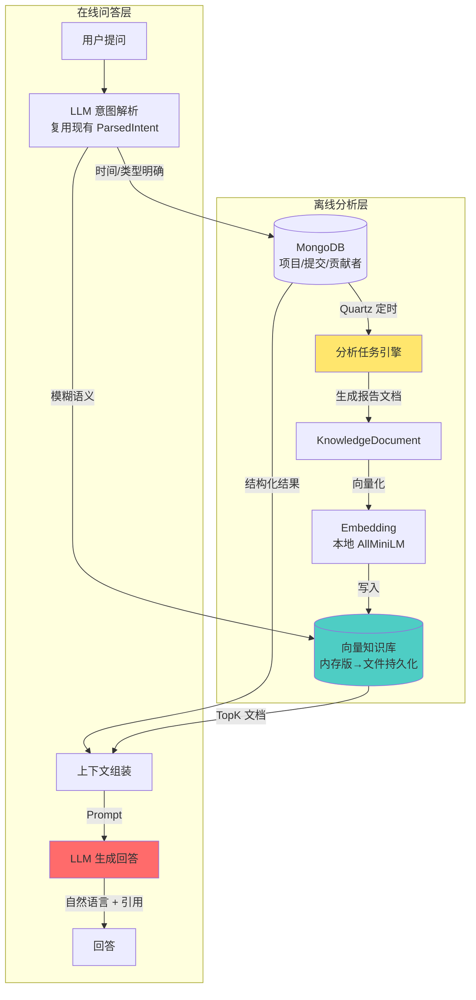

# Agent 智能问答模块设计文档

> GitHub 开源项目分析平台 — RAG + Agent 扩展

---

## 1. 背景与目标

### 1.1 现有能力

| 模块 | 能力 | 限制 |
|------|------|------|
| 语义搜索 | "找 Java Web 框架" → 返回项目列表 | 只能搜项目，不能回答问题 |
| 项目浏览 | 筛选/排序/分页 | 没有聚合分析视角 |

### 1.2 目标

构建一个 **RAG 智能问答 Agent**，让用户可以像问研究员一样提问：

```
"今年三月最火的项目是什么？"
"Python 和 Java 哪个增长更快？"
"AI 品类最近趋势如何？"
"浏览器自动化有哪些值得关注的项目？"
```

Agent 从分析知识库中检索相关数据，结合 LLM 生成自然语言回答，并附带数据来源。

---

## 2. 核心架构



### 2.1 为什么离线分析 + 在线查询？

| 方案 | 做法 | 问题 |
|------|------|------|
| 实时查 MongoDB | 每次提问现算聚合 | 慢（几百条数据也要几十ms），LLM 无法直接吃原始数据 |
| **离线分析 + 向量化** ✅ | 定时任务预计算，生成结构化文档存入知识库 | 问答时只需检索 3-5 条文档，秒级响应 |

### 2.2 关键认知：知识库不是 LLM 生成的

```
❌ 错误: LLM 逐个项目分析 → 写报告 → 存入知识库
✅ 正确: MongoDB 聚合统计 → Java 模板拼文本 → 向量化存入知识库
```

**LLM 在整个链路中只做两件事**：① 解析用户提问意图 ② 生成最终回答。
中间的"分析"全是 MongoDB aggregation + Java 字符串模板，**零 LLM 调用**，毫秒级完成。

### 2.3 分析频率

| 报告类型 | 频率 | Quartz Cron | LLM 调用？ |
|----------|------|-------------|------------|
| 月度趋势 | 每月 1 次 | `0 0 2 1 * ?` | ❌ 无 |
| 语言排名 | 每月 1 次 | `0 0 2 1 * ?` | ❌ 无 |
| 品类趋势 | 每周 1 次 | `0 0 3 ? * MON` | ❌ 无 |
| 项目摘要 | 新项目入库时 | 爬虫回调 | ❌ 无 |

### 2.4 知识文档生成示例（伪代码）

```java
// 纯 MongoDB 聚合，零 LLM
public KnowledgeDocument generateMonthlyReport(String period) {
    
    // 1. 聚合查询：星标增长 Top 10 (< 50ms)
    List<Project> top = mongoTemplate.aggregate(
        match(where("starsCount").gte(10)),
        sort(desc("starsCount")), limit(10)
    );
    
    // 2. 聚合查询：语言分布 (< 30ms)
    List<LangStat> langs = mongoTemplate.aggregate(
        group("language").count().as("cnt"),
        sort(desc("cnt"))
    );
    
    // 3. Java 字符串模板拼文本（不用 LLM！）
    String content = """
        【%s GitHub 项目热度月报】
        星标增长 Top 10:
        %s
        最活跃语言: %s
        """.formatted(period, formatTopList(top), formatLangStats(langs));
    
    // 4. 向量化存入知识库
    return knowledgeBase.ingest("monthly_trend", period, content);
}
```

---

## 3. 知识文档模型

### 3.1 KnowledgeDocument

```java
public record KnowledgeDocument(
    String id,                  // UUID
    String type,                // monthly_trend | language_rank | category_trend | project_analysis
    String period,              // 2026-03 (monthly) / 2026-Q1 (quarterly)
    String title,               // "2026年3月 GitHub 项目热度月报"
    String content,             // 正文 — 会被向量化检索
    Map<String, Object> metadata // 结构化字段: 语言/品类/排行等
) {}
```

### 3.2 文档类型与内容模板

#### A. 月度趋势 `monthly_trend`

```text
【2026年3月 GitHub 项目热度月报】

星标增长 Top 10:
1. deepseek-ai/DeepSeek-R1 — 星标 +22,000 | 语言: Python | 品类: AI
2. browser-use/browser-use — 星标 +15,000 | 语言: Python | 品类: AI
...

本月新项目: 1,200 个
活跃项目(有更新): 8,500 个
最活跃语言: Python(32%), JavaScript(28%), Java(15%)
最活跃品类: AI(25%), Web(20%), Tool(15%)
```

#### B. 语言排名 `language_rank`

```text
【2026年Q1 编程语言活跃度排行】

按新增项目数:
1. Python — 新增 350 个，总星标增长 280k
2. JavaScript — 新增 280 个，总星标增长 210k
3. Java — 新增 200 个，总星标增长 150k

按平均星标:
1. Rust — 平均 2,300 ⭐
2. Go — 平均 1,800 ⭐
...
```

#### C. 品类趋势 `category_trend`

```text
【2026年3月 品类分布分析】

品类占比: AI(25%), Web(20%), Tool(15%), Data(12%), DevOps(10%), ...
增长最快品类: AI(+8% MoM), Security(+3% MoM)
下降品类: Mobile(-2% MoM)
```

#### D. 项目分析 `project_analysis`

针对高价值项目的深度摘要：
```text
【项目分析】Snailclimb/JavaGuide
品类: AI | 语言: Java | 星标: 156k | Fork: 46k
描述: Java 面试指南，覆盖 AI/数据库/分布式/高并发
核心标签: java, ai, deepseek, mcp, springai
贡献者: 100 人 | 活跃度: 高
```

---

## 4. Embedding 方案

### 4.1 选型

使用 **LangChain4j + all-MiniLM-L6-v2** 本地模型：

| 属性 | 值 |
|------|-----|
| 模型 | all-MiniLM-L6-v2 |
| 维度 | 384 |
| 大小 | ~90MB |
| 速度 | < 5ms/条 |
| 部署 | 内嵌 JVM，零外部依赖 |

### 4.2 依赖

```xml
<dependency>
    <groupId>dev.langchain4j</groupId>
    <artifactId>langchain4j-embeddings-all-minilm-l6-v2</artifactId>
    <version>0.36.2</version>
</dependency>
```

### 4.3 配置

```java
@Configuration
public class EmbeddingConfig {
    @Bean
    public EmbeddingModel embeddingModel() {
        return new AllMiniLmL6V2EmbeddingModel();
    }
}
```

---

## 5. Agent 问答流程

### 5.1 入口

```
POST /api/agent/ask
{
  "question": "今年三月最火的项目是什么？",
  "topK": 3
}
```

### 5.2 处理流程

```java
// AgentService.java
public AgentResponse ask(String question, int topK) {
    // Step 1: LLM 解析问题意图（复用现有 ParsedIntent）
    ParsedIntent intent = parseQuestionIntent(question);
    // → time=2026-03, type=monthly_trend, isPrecise=true

    List<KnowledgeDocument> docs;

    // Step 2: 检索策略分流
    if (intent.isTimePrecise()) {
        // 精确查询: 用 metadata 过滤
        docs = knowledgeBase.searchByMetadata(intent.time, intent.type);
    } else {
        // 语义检索: embedding 相似度
        docs = knowledgeBase.searchByVector(question, topK);
    }

    // Step 3: 组装 Prompt
    String prompt = buildPrompt(docs, question);

    // Step 4: LLM 生成回答
    String answer = chatModel.generate(prompt);

    return AgentResponse.builder()
        .question(question)
        .answer(answer)
        .sources(docs.stream().map(KnowledgeDocument::title).toList())
        .build();
}
```

### 5.3 Prompt 模板

```
你是一个 GitHub 开源项目分析助手。请根据以下知识库内容回答用户问题。

知识库内容（按相关度排序）:
---
{doc1.content}
---
{doc2.content}
---
{doc3.content}
---

用户问题: {question}

要求:
- 回答基于知识库内容，不要编造
- 如果有具体数据（星标数、排名等），请引用
- 如果知识库不足以回答，请说明
- 用中文回答，简洁专业
```

### 5.4 检索策略

| 问题特征 | 策略 | 示例 |
|----------|------|------|
| 有明确时间 | metadata 精确查 | "今年三月" → period=2026-03 |
| 有明确类型 | type 过滤 | "哪个语言最流行" → type=language_rank |
| 模糊语义 | vector search | "浏览器自动化项目" → embedding 相似度 |
| 时间+语义 | 双路召回 | 先时间过滤，再 vector 排序 |

---

## 6. 目录结构

```
Nosql-Homework/src/main/java/com/example/Nosql_Homework/
├── agent/
│   ├── AgentService.java              ← 问答编排入口
│   ├── KnowledgeBaseService.java      ← 知识库 CRUD + 检索
│   ├── KnowledgeDocument.java         ← 知识文档 POJO
│   ├── AnalysisTaskService.java       ← 离线分析生成知识文档
│   └── embedding/
│       └── EmbeddingService.java      ← 向量化封装
├── controller/
│   └── AgentController.java           ← POST /api/agent/ask
├── config/
│   └── EmbeddingConfig.java           ← Embedding Bean
```

---

## 7. 接口设计

### 7.1 智能问答

```
POST /api/agent/ask
Content-Type: application/json

{
  "question": "今年三月最火的项目是什么？",
  "topK": 3
}
```

响应：

```json
{
  "code": 0,
  "msg": "ok",
  "data": {
    "question": "今年三月最火的项目是什么？",
    "answer": "根据2026年3月的分析数据，星标增长最快的项目是 deepseek-ai/DeepSeek-R1，当月新增 22,000 星标，属于 AI 品类...",
    "sources": [
      "2026年3月 GitHub 项目热度月报"
    ],
    "confidence": 0.85
  }
}
```

### 7.2 触发分析（管理用）

```
POST /api/agent/analyze?period=2026-03
```

---

## 8. 实施计划

| 阶段 | 内容 | 预估 |
|------|------|------|
| **Phase 1** | `EmbeddingConfig` + `EmbeddingService` — 本地模型跑通 | 小 |
| **Phase 2** | `KnowledgeDocument` + 内存向量存储 — 硬编码 3-5 条文档验证链路 | 小 |
| **Phase 3** | `AgentService` + `AgentController` — 问答接口打通 | 小 |
| **Phase 4** | `AnalysisTaskService` — 从 MongoDB 聚合生成真实知识文档 | 中 |
| **Phase 5** | 前端问答界面 | 小 |
| **Phase 6** | 向量存储持久化（本地文件） + 增量更新 | 中 |

---

## 9. 与现有语义搜索的关系

| | 语义搜索 | Agent 问答 |
|---|---|---|
| **入口** | POST /api/search/nl | POST /api/agent/ask |
| **输入** | "找 Java Web 框架" | "今年三月最火的项目" |
| **检索对象** | Project 集合 | KnowledgeDocument 知识库 |
| **输出** | 项目列表 | 自然语言回答 |
| **LLM 角色** | 意图解析（前置） | 意图解析 + 生成回答（前后双用） |
| **复用** | — | ParsedIntent、LLM Bean、MongoTemplate |

两者互补不冲突，Agent 依赖语义搜索的 LLM 链路，但数据源和输出完全不同。
