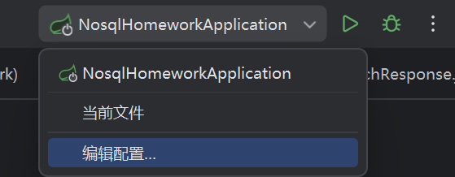
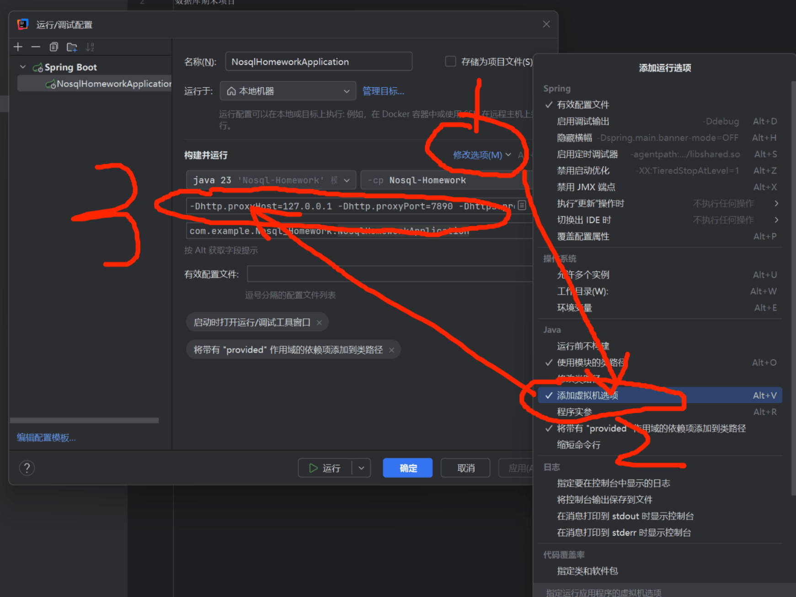

# NosqlHomework

数据库期末项目

---

## 必做准备工作

### 1. 启动 MongoDB

使用 Docker 拉取 MongoDB，推荐再安装 [MongoDB Compass](https://www.mongodb.com/products/compass) 作为可视化工具。

### 2. 创建本地配置文件

在 `Nosql-Homework/src/main/resources/` 目录下新建 `application-local.properties` 文件，内容如下：

```properties
# MongoDB
MONGO_URI=mongodb://xxxxxxx

# LLM API Key
LLM_API_KEY=sk-xxxxxxxx

# Embedding API Key (阿里 DashScope text-embedding-v4)
tiger.rag.embedding.api-key=sk-ws-xxxxxxx

# GitHub Token（多个用逗号分隔）
GITHUB_TOKENS=ghp_xxxxxxxx
```

### 3. 填入配置值

在 `application-local.properties` 中填入对应的值，懒得配可以在群里问我要。

### 4. 配置代理（梯子）

GitHub API 和 LLM 接口需要科学上网。在 IDEA 运行配置的 **VM options** 中添加：

```
-Dhttp.proxyHost=127.0.0.1
-Dhttp.proxyPort=7890
-Dhttps.proxyHost=127.0.0.1
-Dhttps.proxyPort=7890
```

> 以上为 Clash 默认端口，其他代理工具请修改为对应的地址和端口号。

> 
>
### 5. 启动项目

**后端：**
idea直接运行

**前端：**

```bash
# 在 Nosql-Frontend 目录下
npm install
npm run dev
```

---

## 技术栈

| 层级 | 技术 | 版本 |
|------|------|------|
| 后端框架 | Java + Spring Boot | 17 / 3.3+ |
| 数据库 | MongoDB | 6.0+ |
| 爬虫调度 | Quartz | 2.3+ |
| LLM 编排 | LangChain4j + DeepSeek | - |
| 前端框架 | Vue 3 + Vite | 3.4+ / 5.0+ |
| UI 组件 | Element Plus | 2.7+ |
| 图表 | ECharts | 5.5+ |
